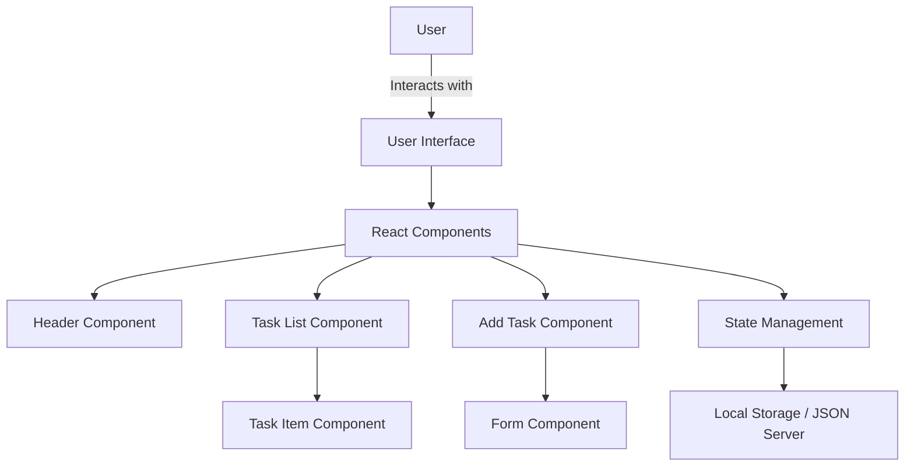

### Explanation

1. **User**: The end-user interacts with the application through the user interface.

2. **User Interface**: The user interface is built using React and consists of various components.

3. **React Components**:
   - **Header Component**: Displays the header of the application.
   - **Task List Component**: Displays the list of tasks.
   - **Add Task Component**: Provides a form to add new tasks.
   - **Task Item Component**: Represents an individual task item within the task list.
   - **Form Component**: Handles the input form for adding tasks.

4. **State Management**: Manages the state of tasks within the application using React's `useState` and `useEffect` hooks.

5. **Local Storage / JSON Server**: Stores task data locally or interacts with a JSON server for data persistence.

6. **Backend API (Optional)**: An optional backend API can be used for more complex data interactions.

7. **Database (Optional)**: An optional database can be used for storing task data in a more robust manner.

### Data Flow

1. **User Interaction**: The user interacts with the user interface to add, delete, or toggle tasks.
2. **React Components**: The user interface is composed of various React components that handle different parts of the application.
3. **State Management**: The state of the tasks is managed using React's state management hooks.
4. **Data Persistence**: Task data is persisted either in local storage or a JSON server.
5. **Optional Backend**: For more complex applications, an optional backend API and database can be used for data persistence and retrieval.

### Detailed Component Interaction

1. **Header Component**: Displays the title of the application.
2. **Task List Component**: 
   - Fetches tasks from the state or server.
   - Renders a list of `Task Item` components.
3. **Task Item Component**:
   - Displays individual task details.
   - Handles task deletion and toggling of the reminder.
4. **Add Task Component**:
   - Renders a form to add new tasks.
   - Updates the state with the new task.
5. **Form Component**:
   - Handles user input for adding tasks.
   - Submits the form to add a new task to the state.
